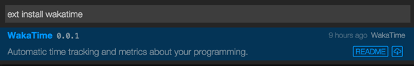
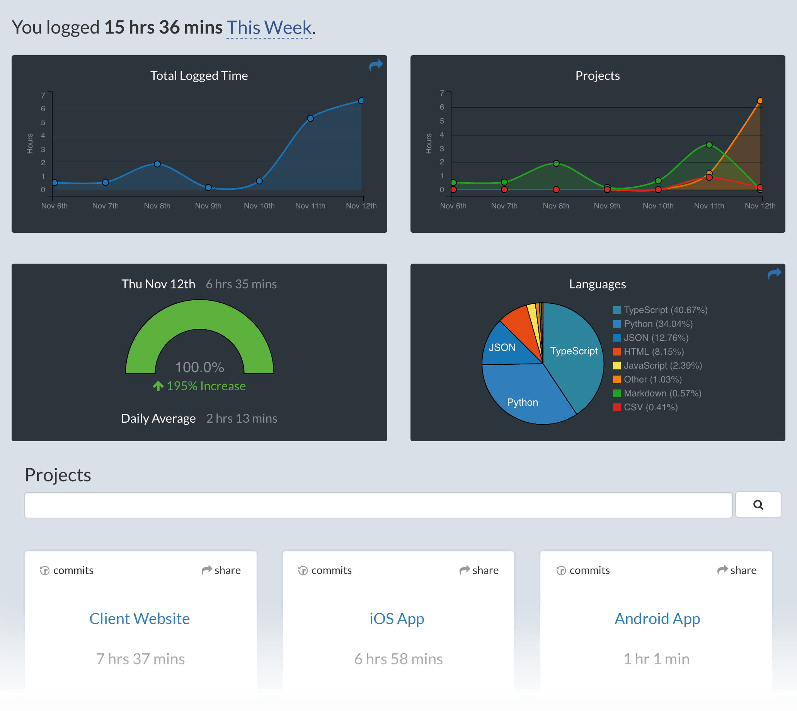

# WakaTime for Visual Studio Code

Metrics, insights, and time tracking automatically generated from your programming activity.

## Installation

1. Visit https://wakatime.com and create a account using GitHub account. Then [add username](https://wakatime.com/settings/profile) in profile tab.(Kindly ignore if it is already done)

2. Press `F1` or `⌘ + Shift + P` and type `install`. Pick `Extensions: Install Extension`.

    
3. Type `wakatime` and hit `enter`.

    

4. Restart Visual Studio Code.

5. Enter your [api key](https://wakatime.com/settings?apikey=true), then press `enter`.

    > (If you’re not prompted, press `F1` or `⌘ + Shift + P` then type `WakaTime API Key`.)

6. Use VSCode and your coding activity will be displayed on your [WakaTime dashboard](https://wakatime.com)

## Usage

Visit https://wakatime.com to see your coding activity.

